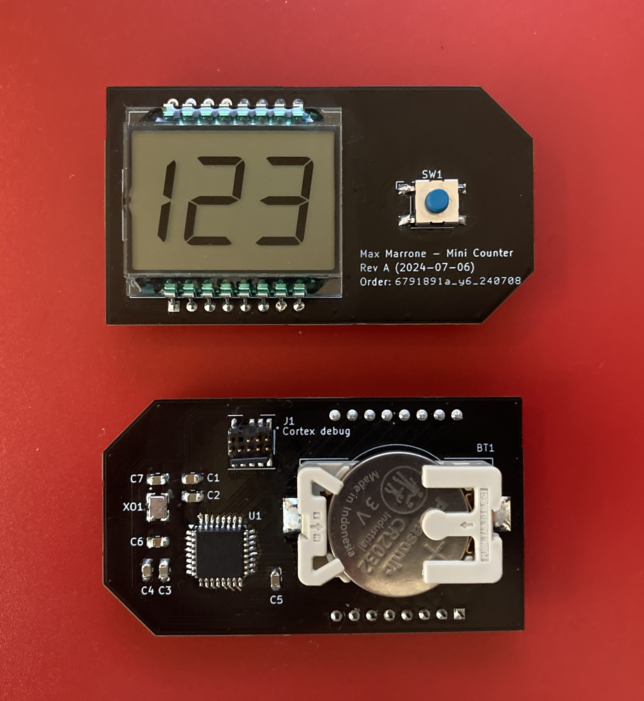

# Introduction

The Counter Thing is a hardware device with a button and numeric display. It currently counts days going up, and resets to 0 when you press the button.

I should run ~1 year on a CR2032 battery and keep time with a drift of <15 minutes/year.

I use a few as household reminders, like keeping track of how many days it's been since I've last vacuumed or watered my plants.

This repository holds everything for the project (electronics and software).

# File organization

[pcb/](./pcb/) has the KiCad project files for the latest version of the board. [pcb/fabrication_outputs/](./pcb/fabrication_outputs) has pre-exported Gerbers and such, ready to send to a fab. I used JLCPCB, but any of them will probably work.

[firmware/](./firmware/) has the STM32CubeIDE project files and source code for the firmware.
